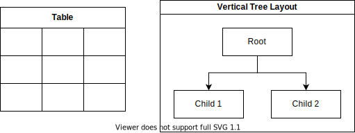

<!--_class: top-->

# タイトル

## 会社
## 部署
## 氏名
## Email:

---
<!--_class: normal-->

# 使い方

- [Marp for VS Code](https://marketplace.visualstudio.com/items?itemName=marp-team.marp-vscode)をインストール

- `setting.json`は下記の通り

```json
{
    "markdown.marp.themes": [
        "./themes/custom.css"
    ],
    "markdown.marp.enableHtml": true
}
```

---
<!--_class: normal-->

# 見出し
## Test
### Test
#### Test
##### Test

---
<!--_class: normal-->

# リスト

- test
  - test
    - test

1. test
   1. test
      1. test

---
<!--_class: normal-->

# 表

[text table](https://marketplace.visualstudio.com/items?itemName=RomanPeshkov.vscode-text-tables)

| test | test | test |
| ---- | ---- | ---- |
| test | test | test |
| test | test | test |
| test | test | test |
| test | test | test |
| test | test | test |

---
<!--_class: normal-->

# コード

```c++
#include <iostream>

int main()
{
  std::cout << "Hello World" << std::endl;
  std::cout << "Hello World" << std::endl;
  std::cout << "Hello World" << std::endl;
  std::cout << "Hello World" << std::endl;
  std::cout << "Hello World" << std::endl;
  std::cout << "Hello World" << std::endl;
  return 0;
}
```

---
<!--_class: normal-->

# TEST

TESTTESTTESTTESTTESTTESTTESTTESTTESTTESTTESTTESTTESTTESTTESTTESTTESTTESTTESTTESTTESTTESTTESTTESTTESTTESTTESTTESTTESTTESTTESTTESTTESTTESTTESTTESTTESTTESTTESTTESTTESTTESTTESTTESTTESTTESTTESTTESTTESTTESTTESTTESTTESTTESTTESTTESTTESTTESTTESTTESTTESTTESTTESTTESTTESTTESTTESTTESTTESTTESTTESTTESTTESTTESTTESTTESTTESTTESTTESTTESTTESTTESTTESTTESTTESTTESTTESTTESTTESTTESTTESTTESTTESTTESTTESTTESTTESTTESTTESTTESTTESTTESTTESTTESTTESTTESTTESTTESTTESTTESTTESTTESTTESTTESTTESTTESTTESTTESTTESTTESTTESTTESTTESTTESTTESTTESTTESTTESTTESTTESTTESTTESTTESTTESTTESTTE

---
<!--_class: normal-->

# 文字装飾

- **TEST**
- *TEST*
- ~~TEST~~
- `TEST`
- <font color="Red">TEST</font>
- <font size=5px>TEST</font>

---
<!--_class: normal-->

# 画像


---
<!--_class: normal-->

# 数式 Katex

<font size=10px>

$$ a = b + c $$

</font>

$$ a = \sum $$

$$
\begin{aligned}
   a&=b+c \\
   d+e&=f
\end{aligned}
$$

---
<!--_class: normal-->

# 図形

## [Draw.io Integration](https://marketplace.visualstudio.com/items?itemName=hediet.vscode-drawio)




---
<!--_class: final-->
